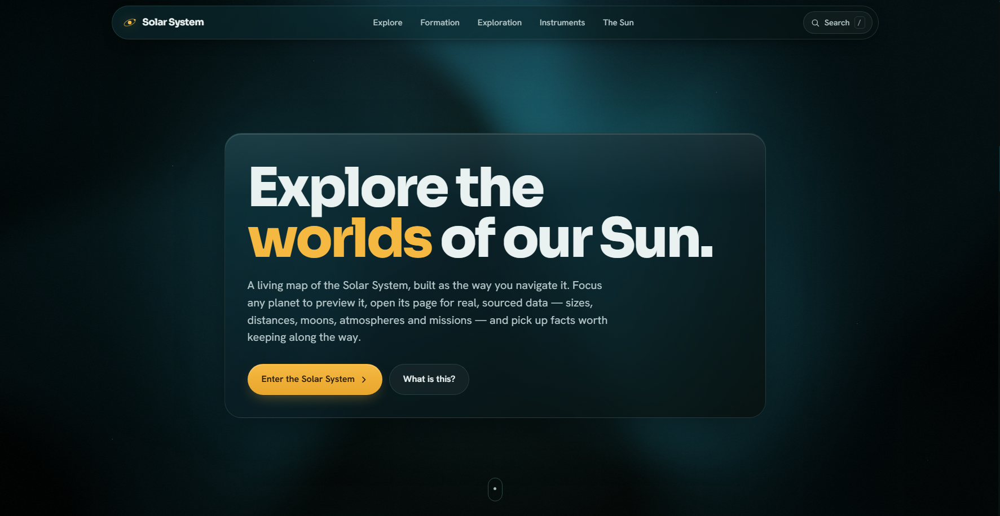
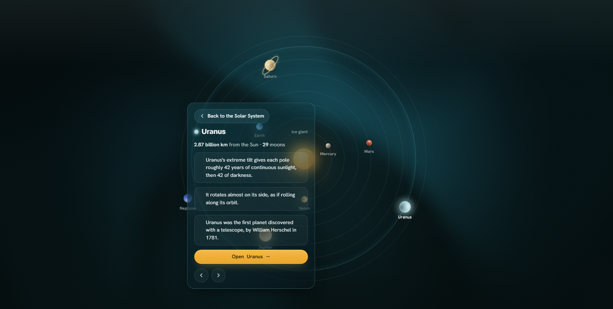
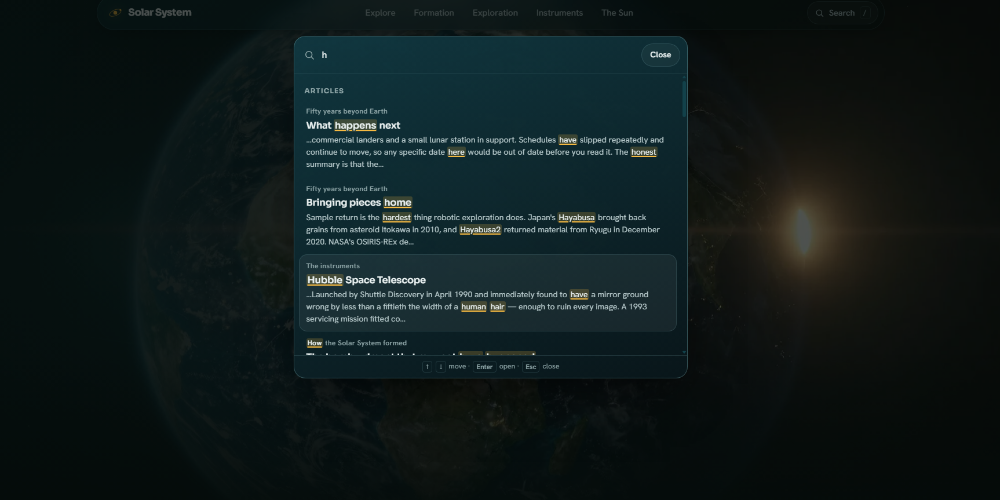
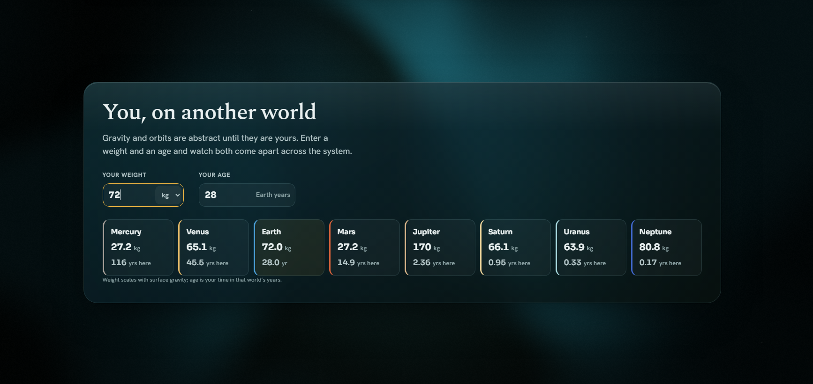
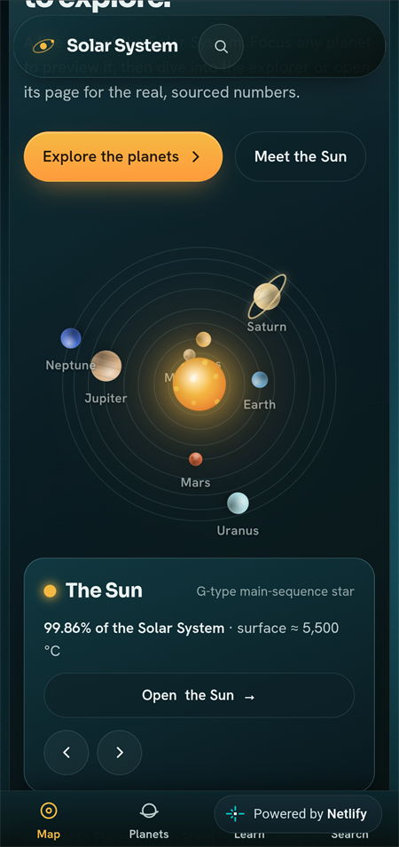
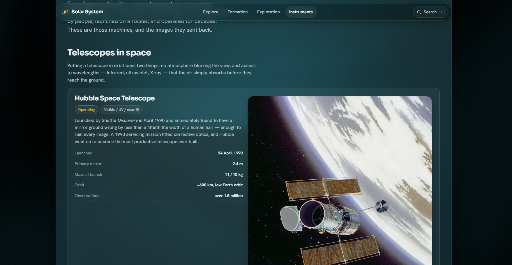

# 🌌 Solar System Exploration

**Explore the Solar System. Discover new worlds. Learn how humanity explores space.**

🌐 **Visit the Website**

Explore **Solar System Exploration** directly from your browser:

🚀 **[Open Solar System Exploration](https://tigerkossk.github.io/Solar-System-Exploration/)**

Discover the Sun, planets, moons, missions, discoveries, instruments, and the incredible story of humanity's exploration of our cosmic neighborhood.

---

# 📱 Available on Mobile

**Solar System Exploration is now available on mobile devices!**

The website has been adapted to provide a **fully functional mobile experience**, allowing you to explore the Solar System directly from your phone or other mobile devices.

The mobile version includes the main functionality of the website, including:

* 🪐 Exploring planets and Solar System objects
* 🔎 Using the Search Box
* 🚀 Exploring missions and discoveries
* 🔭 Learning about scientific instruments
* 🌌 Reading about Solar System formation
* 🎮 Using the Playground
* ✨ Interacting with the website's animations and interactive elements

The mobile version is still being improved, so **small visual problems, layout issues, or other minor bugs may occasionally appear on certain devices or screen sizes**.

We are continuing to test and improve the mobile experience to make it smoother, more reliable, and more comfortable to use.

> 📱 **The Solar System is now in your pocket.**

---

# 🔎 New Feature — Search Box

Finding information is now much easier.

The new **Search Box** allows you to search through the information available across the website and quickly find the content you are looking for.

Simply enter what you want to learn about and the website will help you locate the relevant information.

### ✨ What makes it useful?

* 🔎 Quickly search for information across the website
* 📚 Find available educational content without manually looking through every section
* ⚡ Get to relevant information faster
* 📝 **Search results are underlined**, making the matched information easy to identify
* 🌌 Search across different parts of the Solar System experience

Whether you are looking for a planet, mission, instrument, discovery, or another topic covered by the website, the Search Box makes exploration much easier.

---

# 🎮 New Feature — Playground

Want to do something a little more fun?

The new **Playground** gives you an interactive way to explore how different worlds in our Solar System would affect you.

You can see:

### 🎂 Your Age on Other Worlds

Find out **how old you would be on different planets** of the Solar System.

Because planets orbit the Sun at different speeds, a "year" is different on each world. The Playground lets you compare your age across the Solar System.

### ⚖️ Your Weight on Other Worlds

See **how much you would weigh on different planets**.

Different planets have different gravitational strengths, so your weight would change depending on where you are standing.

> 🪐 **Same person. Different world. Different age. Different weight.**

The Playground is designed to make learning about planetary science more interactive, visual, and fun.

---

# 🎬 See It Live

The website itself is the best demonstration of the project.

The orbital map, scroll-driven introduction, interactive planet dashboards, animations, Search Box, and Playground are designed to be experienced directly rather than understood from screenshots alone.

🚀 **[Open Solar System Exploration](https://tigerkossk.github.io/Solar-System-Exploration/)**

---

# 🌌 What Is Solar System Exploration?

**Solar System Exploration** is a modern, interactive educational website created to help people explore and understand our Solar System in an engaging and visually appealing way.

The project combines a **cool, modern, and fresh design** with educational information about the worlds and objects that make up our cosmic neighborhood.

It is designed for anyone interested in space — from curious beginners discovering astronomy for the first time to people who already enjoy learning about the universe.

The goal is not simply to present facts, but to make exploring space feel **interesting, interactive, and enjoyable**.

---

# ☀️ Explore the Solar System

The website brings together information about many different parts of our cosmic neighborhood, including:

* ☀️ **The Sun**
* 🪐 **The planets**
* 🌙 **Moons and natural satellites**
* ☄️ **Asteroids, comets, and other small Solar System objects**
* 🚀 **Humanity's exploration and space missions**
* 🔭 **Scientific instruments and technologies**
* 🛰️ **Important discoveries and observations**
* 🌍 **Different worlds and regions of the Solar System**
* 🌌 **The formation and evolution of the Solar System**

Everything is organized to make it easier to explore the Solar System from both an educational and interactive perspective.

---

# 🚀 More Than 50 Years of Exploration

Humanity has spent **decades exploring the Solar System** using spacecraft, probes, rovers, orbiters, telescopes, and other scientific technologies.

Solar System Exploration presents this history as part of a much bigger story: our continuing attempt to understand the worlds around us.

From the planets closest to Earth to the distant regions of the Solar System, decades of missions and observations have dramatically expanded our knowledge of our cosmic neighborhood.

The website focuses on two important questions:

### 🌌 What is out there?

Explore the planets, moons, objects, environments, structures, and regions that make up the Solar System.

### 🚀 What have we discovered?

Learn about the missions, observations, technologies, instruments, and discoveries that have expanded humanity's understanding of space.

---

# ✨ Design & Experience

Solar System Exploration is designed to feel more like an **interactive exploration experience** than a traditional textbook.

The experience focuses on:

* 🎨 Modern and clean visual design
* 📚 Easy-to-understand educational information
* 🌌 Space-themed visuals
* 🪐 Interactive exploration
* 🔭 Organized scientific content
* 🚀 Missions and exploration history
* 🎮 Interactive features such as the Playground
* 🔎 Fast access to information through Search
* 📱 Support for mobile devices
* ⚡ A balance between quick facts and deeper discovery

---

# 📚 Educational Content

The project has been expanded to provide substantially more information for users who want to learn about the Solar System, its formation, exploration, and the technologies used to study it.

## 🌌 Formation

The **Formation** section explains how the Solar System developed and how its major components formed over time.

It includes:

* An overview of Solar System formation
* Explanations of the processes that shaped the Sun, planets, and other objects
* Scientific information
* NASA-sourced information and imagery
* Visual material to make the subject easier to understand

---

## 🔭 Instruments

The **Instruments** section introduces the scientific instruments, spacecraft, telescopes, and technologies that have helped humanity study the Solar System.

It provides information such as:

* The purpose and capabilities of different instruments
* Technical specifications and important characteristics
* Photographs of instruments and missions
* Images and scientific observations
* Explanations of how instruments contributed to our understanding of space

---

## 🚀 Exploration

The **Exploration** section presents the history of Solar System exploration over the past several decades.

It covers major stages, missions, discoveries, and technological achievements that expanded our understanding of planets and other Solar System objects.

The section also includes:

* Historical and scientific information
* Mission imagery
* Important exploration milestones
* Major spacecraft and missions
* Significant discoveries and observations

---

# 🛰️ Missions, Landmarks & Discoveries

Solar System Exploration includes more detailed information about **important missions, landmarks, discoveries, and scientific observations**.

Users can learn not only about celestial objects themselves, but also about the missions and technologies that made their study possible.

This helps connect individual discoveries with the spacecraft, instruments, and missions responsible for them, providing additional historical and scientific context.

---

# 🪐 Expanded Planet Information

The **Explore Solar System** section has been significantly expanded with additional information about the planets.

Planet pages provide deeper information about their:

* Physical characteristics
* Atmospheric properties
* Environments
* Important features
* Scientific significance
* Exploration history

This makes the **Explore Solar System** section useful not only for casual exploration, but also as a convenient educational reference.

---

# 🖼️ Screenshots & Preview

Want to see what the website looks like?

Screenshots can be added here to show different parts of the Solar System Exploration experience.

### 🌌 Main Menu

### 🪐 Explore Solar System

### 🔎 Search Box

### 🎮 Playground

### 📱 Mobile Version

  

### 🚀 Exploration & Missions

---

# 🛠️ Stability, Bug Fixes & Improvements

The project has received a major update focused on **reliability, usability, educational content, and the depth of information available to users**.

A comprehensive set of bug fixes, optimizations, and functional improvements has been implemented throughout the project.

These changes include:

* Fixes for previously identified issues
* Improvements to existing functionality
* Usability refinements
* Better organization of information
* Improvements to the interactive experience
* Mobile compatibility improvements
* General performance and reliability improvements

The project continues to evolve, and **additional issues may still be discovered** as more users explore the website across different devices and browsers.

We are continuing to test, improve, and refine the experience.

---

# 🎯 Our Goal

The main goal of **Solar System Exploration** is to make astronomy more accessible, interactive, and exciting.

The project aims to:

* Encourage curiosity about space
* Help users understand the Solar System
* Make educational information easier to explore
* Show how humanity has studied our cosmic neighborhood
* Connect scientific discoveries with the missions and technologies behind them
* Make learning about astronomy more engaging

At the same time, the project highlights an important idea:

> **We have explored a lot of the Solar System — but there is still a huge amount left to discover.**

---

# 🌠 Explore. Discover. Learn.

From the Sun and the inner planets to the outer Solar System and its distant objects, **Solar System Exploration** brings our cosmic neighborhood together in one interactive experience.

Explore worlds.

Discover missions.

Learn how scientists study space.

See how old you would be on another planet.

Find information with Search.

And explore the Solar System from your computer or phone.

### 🚀 **Explore. Discover. Learn. Look beyond Earth.** 🌌

---

*Solar System Exploration — Discover the worlds around us.*

